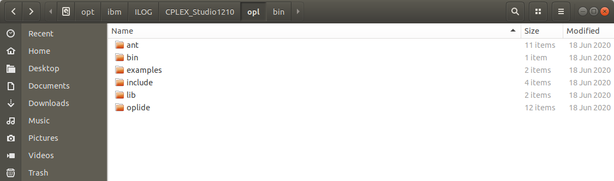

# Mixed-Integer Behavior and Motion Planning
Planner implementation in C++ and the respective optimization source code (for the commercial optimization suite CPLEX). The implementation can be used as a behavior model in [BARK](https://github.com/bark-simulator/bark) and as a planning module for [APOLLO](https://github.com/fortiss/apollo/)

Please have a look into the corresponding publications:
* [Optimal Behavior Planning for Autonomous Driving: A Generic Mixed-Integer Formulation](https://ieeexplore.ieee.org/document/9304743) (IV 2020)
* [Linear Differential Games for Cooperative Behavior Planning of Autonomous Vehicles Using Mixed-Integer Programming](https://ieeexplore.ieee.org/document/9304495) (CDC 2020)

If you use this code, please cite one of the following publications:

```
@inproceedings{esterle2020,
  title={Optimal Behavior Planning for Autonomous Driving: A Generic Mixed-Integer Formulation},
  author={Esterle, Klemens and Kessler, Tobias and Knoll, Alois},
  booktitle={2020 IEEE Intelligent Vehicles Symposium (IV)},
  pages={1914--1921},
  year={2020},
  organization={IEEE}
}
```

```
@inproceedings{kessler2020linear,
  title={Linear Differential Games for Cooperative Behavior Planning of Autonomous Vehicles Using Mixed-Integer Programming},
  author={Kessler, Tobias and Esterle, Klemens and Knoll, Alois},
  booktitle={2020 59th IEEE Conference on Decision and Control (CDC)},
  pages={4060--4066},
  year={2020},
  organization={IEEE}
}
```

## Installation & Test
- Only once: Install [bazel](https://docs.bazel.build/versions/master/install.html)
- Only once: Install the virtual environment `bash python/setup_venv.sh`
- Activate the virtual environment via `source python/into_venv.sh`
- Run `bazel test //...` in the WORKSPACE directory

## Usage within BARK
Have a look to the [example benchmark repo](https://github.com/bark-simulator/example_benchmark). You will need to build the code via `build --cxxopt='-std=c++17' --define planner_miqp=true --test_env LD_LIBRARY_PATH=/opt/ibm/ILOG/CPLEX_Studio1210/opl/bin/x86-64_linux`, see e.g., this' repositories .bazelrc-file.

## Usage within Apollo
The integration within Apollo is done by building all relevant functions of this repository into a library and link this library in Apollo. Please follow the following steps:
1) building the library libmiqp_planner_c_api.so
2) copying it to the Apollo repository by calling `bash deploy_apollo.sh` (you probably need to update the path to Apollo there or pass it as an argument)
3) build Apollo, see [build documentation](https://github.com/fortiss/apollo/blob/dev_fortiss/docs/fortiss/build.md)

# Dependencies
- [Cplex](https://www.ibm.com/support/pages/downloading-ibm-ilog-cplex-optimization-studio-v12100). We use CPLEX Optimization Studio V12.10. Place it at /opt/ibm/ILOG/CPLEX_Studio1210/opl. You should then have the following structure:

